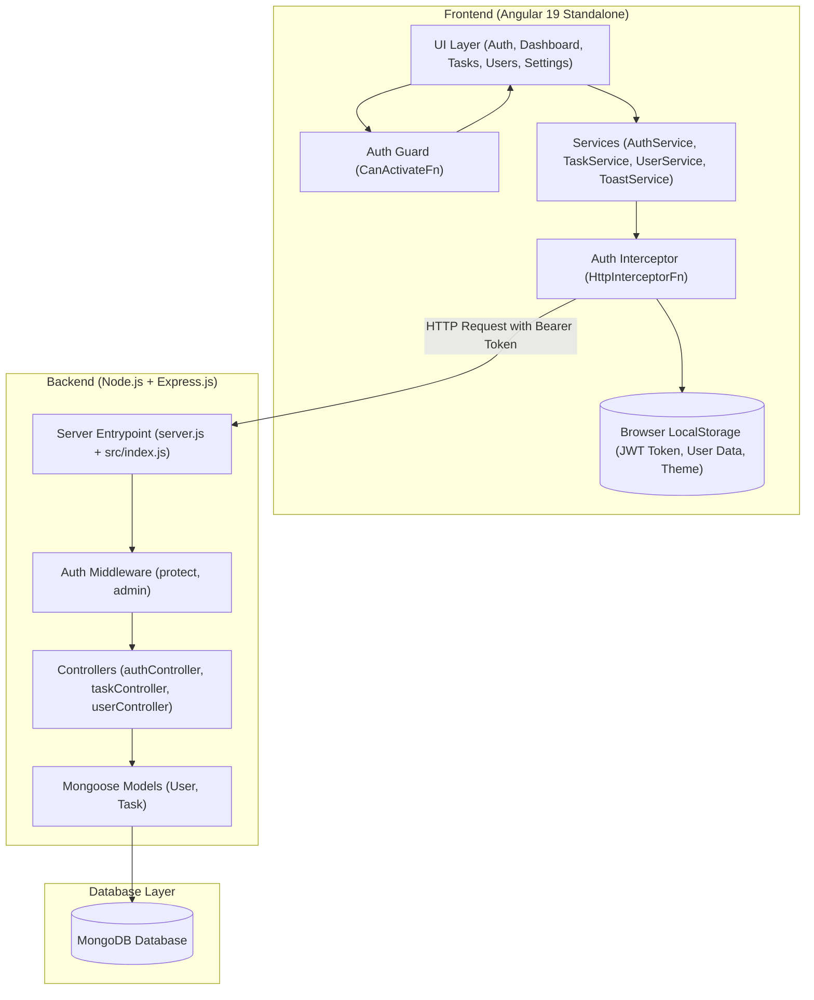
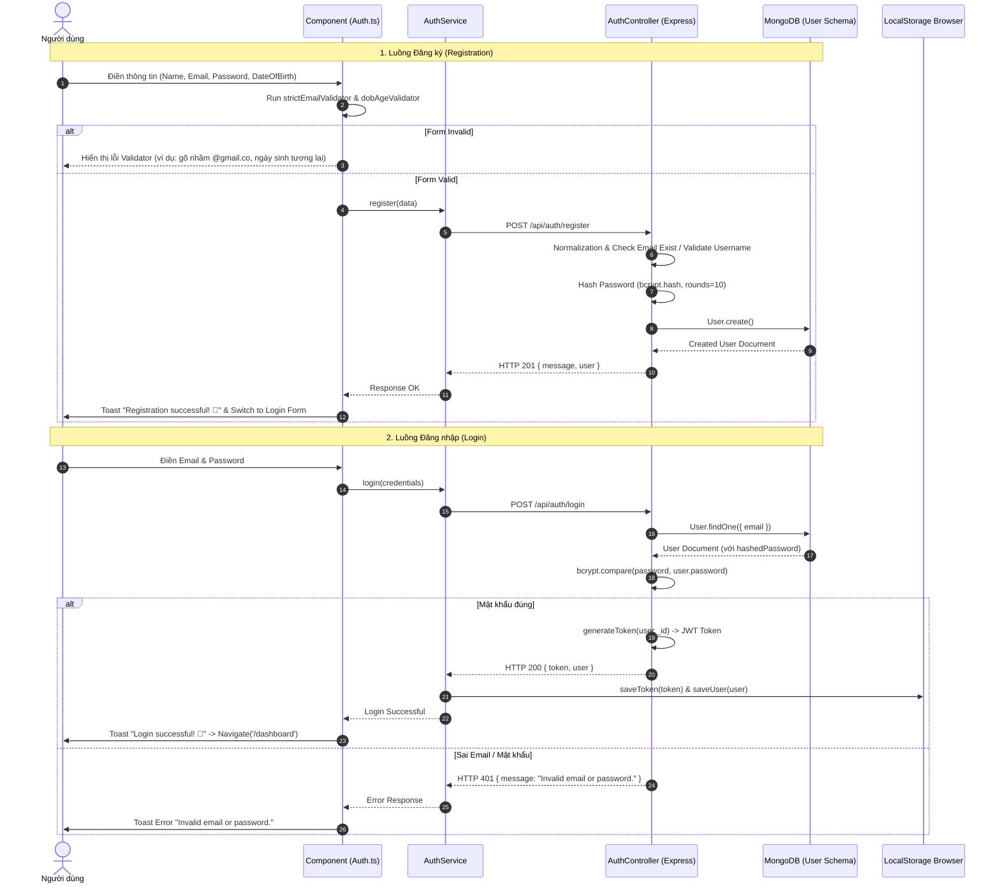
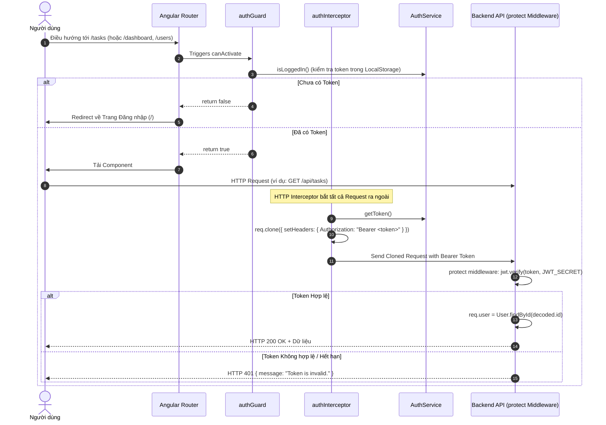
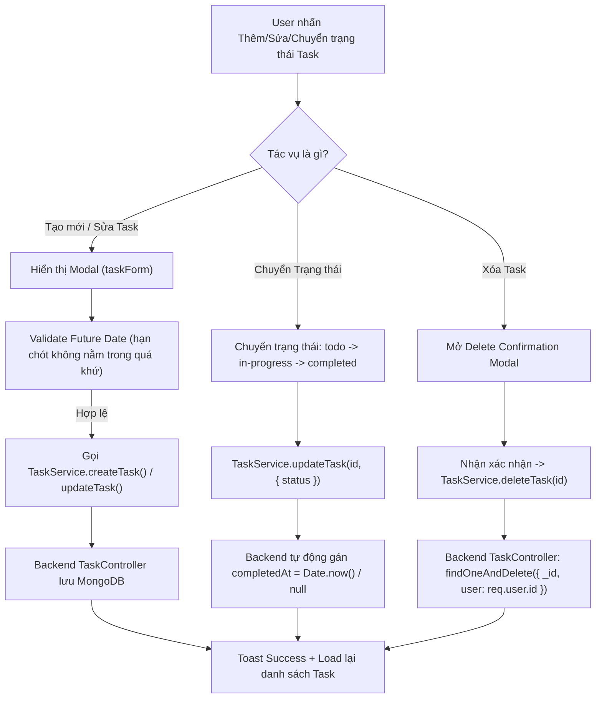
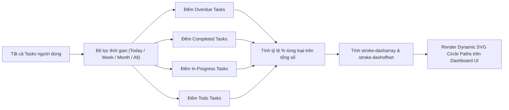
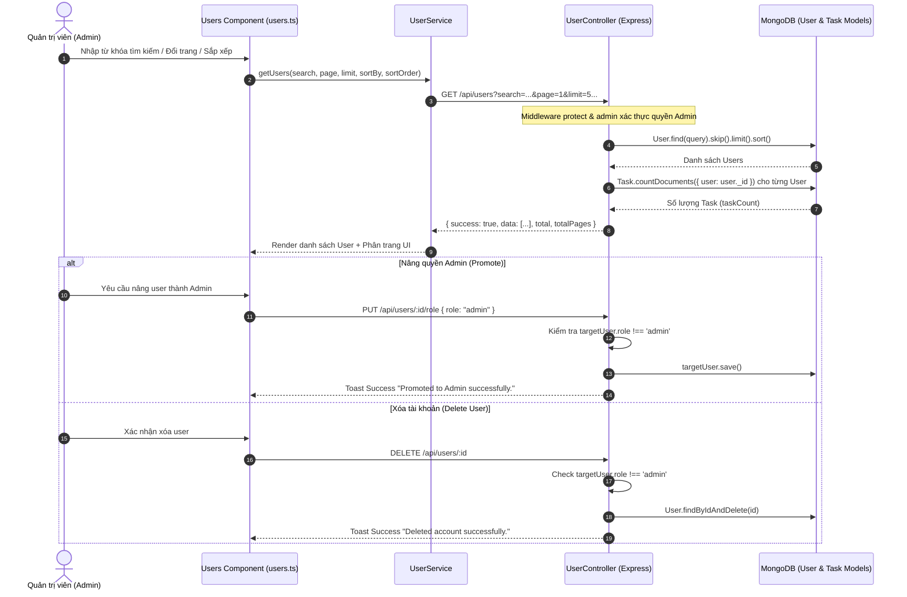

# 📘 ARCHITECTURE & CODEFLOW WORKFLOW DOCUMENTATION: STUDYFLOW (TASKFLOW)

> **Dự án StudyFlow (TaskFlow)** là một hệ thống quản lý công việc và tiến độ học tập/làm việc full-stack hiện đại, được xây dựng theo kiến trúc **Client - Server (SPA + RESTful API)**. 
> Tài liệu này mô tả chi tiết toàn bộ cấu trúc dự án, luồng dữ liệu (codeflow), luồng nghiệp vụ (workflow) và mối tương tác giữa các module từ Frontend đến Backend.

---

## 📐 1. TỔNG QUAN KIẾN TRÚC HỆ THỐNG (SYSTEM ARCHITECTURE)



---

## 🗂️ 2. BẢNG TRA CỨU & CẤU TRÚC CHI TIẾT CÁC FILE (FILE INDEX & ROLES)

### 🔹 2.1 Backend (`d:\StudyFlow\backend`)

| Đường dẫn File | Vai trò & Chức năng |
| :--- | :--- |
| [`server.js`](file:///d:/StudyFlow/backend/server.js) | Entrypoint chính nạp biến môi trường (`.env`), khởi tạo kết nối MongoDB và lắng nghe cổng HTTP (Port 5000). |
| [`src/index.js`](file:///d:/StudyFlow/backend/src/index.js) | Cấu hình Express app, CORS, JSON parser body và đăng ký các tuyến API chính (`/api/auth`, `/api/users`, `/api/tasks`, `/api/health`). |
| [`src/config/db.js`](file:///d:/StudyFlow/backend/src/config/db.js) | Cấu hình và thực hiện kết nối tới database MongoDB bằng Mongoose. |
| [`src/models/User.js`](file:///d:/StudyFlow/backend/src/models/User.js) | Schema Mongoose cho Người dùng: `name`, `email` (unique), `password`, `role` (`user`/`admin`), `dateOfBirth`, `timestamps`. |
| [`src/models/Task.js`](file:///d:/StudyFlow/backend/src/models/Task.js) | Schema Mongoose cho Công việc: `title`, `description`, `priority` (`high`/`medium`/`low`), `dueDate`, `status` (`todo`/`in-progress`/`completed`), `user` (Ref ObjectId), `completedAt`, `timestamps`. |
| [`src/utils/jwt.js`](file:///d:/StudyFlow/backend/src/utils/jwt.js) | Hàm tạo JSON Web Token (`generateToken`) ký mã hóa `userId` với `JWT_SECRET`, thời hạn 7 ngày. |
| [`src/middleware/authMiddleware.js`](file:///d:/StudyFlow/backend/src/middleware/authMiddleware.js) | Middleware xác thực JWT Header (`protect`) và middleware kiểm tra quyền quản trị viên (`admin`). |
| [`src/routes/authRoutes.js`](file:///d:/StudyFlow/backend/src/routes/authRoutes.js) | Khai báo tuyến cho Đăng ký (`POST /register`) và Đăng nhập (`POST /login`). |
| [`src/routes/taskRoutes.js`](file:///d:/StudyFlow/backend/src/routes/taskRoutes.js) | Khai báo các tuyến CRUD cho Task (`GET/POST /`, `GET/PUT/DELETE /:id`). Đều áp dụng `protect`. |
| [`src/routes/userRoutes.js`](file:///d:/StudyFlow/backend/src/routes/userRoutes.js) | Khai báo các tuyến Profile cá nhân (`GET/PUT /profile`, `PUT /change-password`) và Quản lý User cho Admin (`GET /`, `PUT /:id/role`, `DELETE /:id`). |
| [`src/controllers/authController.js`](file:///d:/StudyFlow/backend/src/controllers/authController.js) | Xử lý logic Đăng ký (băm mật khẩu với bcryptjs, validate định dạng email/ngày sinh) & Đăng nhập. |
| [`src/controllers/taskController.js`](file:///d:/StudyFlow/backend/src/controllers/taskController.js) | Xử lý CRUD nhiệm vụ cá nhân của User (lấy danh sách, tạo mới, cập nhật trạng thái/completedAt, xóa). |
| [`src/controllers/userController.js`](file:///d:/StudyFlow/backend/src/controllers/userController.js) | Xử lý xem/sửa profile, đổi mật khẩu, và các thao tác Admin (tìm kiếm regex, phân trang, đếm taskCount, phân quyền/xóa user). |

---

### 🔸 2.2 Frontend (`d:\StudyFlow\frontend`)

| Đường dẫn File | Vai trò & Chức năng |
| :--- | :--- |
| [`src/app/app.config.ts`](file:///d:/StudyFlow/frontend/src/app/app.config.ts) | Cấu hình Angular app provider: router, HTTP client đi kèm `authInterceptor`. |
| [`src/app/app.routes.ts`](file:///d:/StudyFlow/frontend/src/app/app.routes.ts) | Cấu hình định tuyến: Trang Login (`/`), trang Layout chính chứa con (`/dashboard`, `/tasks`, `/settings`, `/users`) được bảo vệ bởi `authGuard`. |
| [`src/app/core/guards/auth.guard.ts`](file:///d:/StudyFlow/frontend/src/app/core/guards/auth.guard.ts) | Chặn truy cập nếu chưa đăng nhập (kiểm tra `AuthService.isLoggedIn()`), tự điều hướng về `/`. |
| [`src/app/core/interceptors/auth.interceptor.ts`](file:///d:/StudyFlow/frontend/src/app/core/interceptors/auth.interceptor.ts) | Đính kèm `Authorization: Bearer <token>` tự động vào header của mọi HTTP request gửi đi. |
| [`src/app/core/services/api.service.ts`](file:///d:/StudyFlow/frontend/src/app/core/services/api.service.ts) | Chứa địa chỉ base API URL (`http://localhost:5000/api`). |
| [`src/app/shared/services/auth.service.ts`](file:///d:/StudyFlow/frontend/src/app/shared/services/auth.service.ts) | Quản lý state Đăng nhập/Đăng ký, lưu trữ/lấy Token & User info từ `localStorage`. |
| [`src/app/shared/services/task.service.ts`](file:///d:/StudyFlow/frontend/src/app/shared/services/task.service.ts) | Đóng gói các hàm gọi API CRUD cho Task. |
| [`src/app/shared/services/user.service.ts`](file:///d:/StudyFlow/frontend/src/app/shared/services/user.service.ts) | Đóng gói các hàm gọi API Profile & Quản lý User (tìm kiếm, phân trang, đổi role, xóa). |
| [`src/app/shared/services/toast.service.ts`](file:///d:/StudyFlow/frontend/src/app/shared/services/toast.service.ts) | Quản lý thông báo Toast Popup sử dụng Angular Signals, tự hủy sau 2 giây. |
| [`src/app/layouts/main-layout/main-layout.ts`](file:///d:/StudyFlow/frontend/src/app/layouts/main-layout/main-layout.ts) | Shell layout chứa Sidebar, Header bar, Dark/Light Mode toggle, Logout, và `router-outlet`. |
| [`src/app/shared/components/sidebar/sidebar.ts`](file:///d:/StudyFlow/frontend/src/app/shared/components/sidebar/sidebar.html) | Thanh điều hướng bên hông, ẩn/hiện menu `Users` theo vai trò `admin`. |
| [`src/app/features/auth/auth.ts`](file:///d:/StudyFlow/frontend/src/app/features/auth/auth.ts) | Trang Đăng nhập & Đăng ký với Reactive Forms, tích hợp validator kiểm tra chính tả Email (tránh gõ nhầm `@gmail.co`) và Ngày sinh. |
| [`src/app/features/dashboard/dashboard.ts`](file:///d:/StudyFlow/frontend/src/app/features/dashboard/dashboard.ts) | Dashboard tổng quan: số liệu thống kê, biểu đồ hình tròn SVG (Donut chart), danh sách nhiệm vụ sắp tới (Urgent/Overdue). |
| [`src/app/features/tasks/tasks.ts`](file:///d:/StudyFlow/frontend/src/app/features/tasks/tasks.ts) | Trang Quản lý Công việc: Tìm kiếm, Lọc ưu tiên/Trạng thái, Sắp xếp thông minh, Thêm/Sửa Modal, Xóa Modal, Phân trang UI. |
| [`src/app/features/users/users.ts`](file:///d:/StudyFlow/frontend/src/app/features/users/users.ts) | Trang Quản lý Người dùng (Dành cho Admin): Tìm kiếm, Phân trang Server-side, Thống kê số lượng Task từng user, Nâng quyền Admin, Xóa User. |
| [`src/app/features/settings/settings.ts`](file:///d:/StudyFlow/frontend/src/app/features/settings/settings.ts) | Trang Cài đặt cá nhân: Cập nhật Tên/Ngày sinh, Đổi mật khẩu với Modal xác nhận. |

---

## 🔄 3. CHI TIẾT CÁC LUỒNG XỬ LÝ NGUYÊN LÝ (CODEFLOWS & WORKFLOWS)

---

### 🔑 3.1 Luồng Xác thực Nguồn Người dùng (Authentication Codeflow)



---

### 🛡️ 3.2 Luồng Bảo vệ Route & Đính kèm Token (Auth Guard & Interceptor Flow)



---

### 📋 3.3 Luồng Quản lý & Sắp xếp Công việc (Task Management Lifecycle Codeflow)

Trong module Task, danh sách công việc được lấy từ Backend và sắp xếp thông minh theo thuật toán ưu tiên thời gian real-time tại Frontend (`tasks.ts`):

1. **Thứ tự Ưu tiên Nhiệm vụ:**
   - Nhiệm vụ khẩn cấp (**Urgent** - sắp hết hạn trong 1 giờ) đứng đầu.
   - Nhiệm vụ theo Trạng thái: `in-progress` (đang làm) -> `todo` (cần làm) -> `completed` (đã xong).
   - Sắp xếp Ngày hết hạn (**dueDate**): Ngày gần nhất xếp trước. Nếu cùng thời gian, so sánh theo Mức độ Ưu tiên (`high` > `medium` > `low`).

2. **Chuyển Trạng thái Nhanh (Complete Task Toggle):**
   - Trạng thái xoay vòng: `todo` ➔ `in-progress` ➔ `completed` (nếu nhấn lại sẽ chuyển về `in-progress`).
   - Backend tự động cập nhật trường `completedAt` bằng `new Date()` nếu status chuyển thành `completed`, hoặc `null` nếu ngược lại.



---

### 📊 3.4 Luồng Tính toán & Hiển thị Biểu đồ Dashboard (Analytics & SVG Donut Chart Codeflow)

Dashboard hiển thị tổng quan tiến độ học tập thông qua biểu đồ SVG vòng tròn (Donut Chart) được vẽ hoàn toàn bằng toán học SVG Dynamic DashOffset (`dashboard.ts`):

- **Chu vi vòng tròn (Circumference)**: \( C = 2 \times \pi \times r = 2 \times \pi \times 36 = 226.19 \).
- **Phần trăm 4 loại Task**:
  1. 🔴 **Overdue (Quá hạn)**: Tính `dashArray` & `dashOffset` bắt đầu tại 0.
  2. 🟢 **Completed (Hoàn thành)**: Offset bằng `- (Overdue % * C)`.
  3. 🟡 **In-Progress (Đang làm)**: Offset bằng `- ((Overdue + Completed) % * C)`.
  4. 🔵 **Todo (Cần làm)**: Offset bằng `- ((Overdue + Completed + In-Progress) % * C)`.



---

### 👥 3.5 Luồng Quản lý Người dùng & Phân quyền Admin (Admin User Management Codeflow)

Chỉ người dùng có `role === 'admin'` mới có quyền truy cập trang `/users`.

1. **Tìm kiếm & Phân trang Server-side (`GET /api/users`)**:
   - Backend hỗ trợ query params: `search`, `page`, `limit`, `sortBy`, `sortOrder`.
   - Tìm kiếm Regex theo `name` hoặc `email` (không phân biệt hoa thường).
   - Backend tự động chạy `Promise.all` đếm số lượng nhiệm vụ (`taskCount`) của từng user để hiển thị trên bảng.
2. **Quy tắc An toàn Phân quyền (RBAC Safety Rules)**:
   - Không được phép hạ quyền (demote) một tài khoản Admin khác.
   - Không được phép xóa (delete) tài khoản Admin.



---

## 🔌 4. DANH SÁCH RESTFUL API ENDPOINTS DETAILED SPECIFICATION

| Method | Endpoint | Protection | Phân quyền | Mô tả chi tiết |
| :--- | :--- | :--- | :--- | :--- |
| `GET` | `/api/health` | Public | Tất cả | Kiểm tra trạng thái hoạt động của API server. |
| `POST` | `/api/auth/register` | Public | Tất cả | Đăng ký tài khoản mới (Name, Email, Password, DateOfBirth). |
| `POST` | `/api/auth/login` | Public | Tất cả | Đăng nhập trả về JWT Token và User Info. |
| `GET` | `/api/users/profile` | Protected | User / Admin | Lấy thông tin chi tiết tài khoản cá nhân đang đăng nhập. |
| `PUT` | `/api/users/profile` | Protected | User / Admin | Cập nhật tên hiển thị và ngày tháng năm sinh. |
| `PUT` | `/api/users/change-password` | Protected | User / Admin | Đổi mật khẩu (Cần nhập đúng mật khẩu hiện tại). |
| `GET` | `/api/users` | Protected | Admin | Danh sách người dùng (hỗ trợ search, pagination, sorting, taskCount). |
| `PUT` | `/api/users/:id/role` | Protected | Admin | Cập nhật vai trò (Role) người dùng (User -> Admin). Chặn demote Admin. |
| `DELETE` | `/api/users/:id` | Protected | Admin | Xóa tài khoản người dùng khỏi hệ thống. Chặn xóa Admin. |
| `GET` | `/api/tasks` | Protected | User / Admin | Lấy toàn bộ danh sách nhiệm vụ của chính user đang đăng nhập. |
| `GET` | `/api/tasks/:id` | Protected | User / Admin | Lấy thông tin chi tiết 1 nhiệm vụ theo ID. |
| `POST` | `/api/tasks` | Protected | User / Admin | Tạo mới nhiệm vụ. |
| `PUT` | `/api/tasks/:id` | Protected | User / Admin | Cập nhật nội dung, ưu tiên, hạn chót, hoặc trạng thái nhiệm vụ. |
| `DELETE` | `/api/tasks/:id` | Protected | User / Admin | Xóa nhiệm vụ theo ID. |

---

## 🚀 5. HƯỚNG DẪN KHỞI CHẠY & THIẾT LẬP DỰ ÁN (SETUP & RUNNING GUIDE)

### 1️⃣ Khởi chạy Backend Service:
```bash
cd d:\StudyFlow\backend
npm install
# Tạo file .env với MONGO_URI, PORT=5000, JWT_SECRET
npm run dev
# Server khởi chạy tại http://localhost:5000
```

### 2️⃣ Khởi chạy Frontend Application:
```bash
cd d:\StudyFlow\frontend
npm install
ng serve --open
# Ứng dụng chạy tại http://localhost:4200
```

---
*Tài liệu Codeflow Workflow này được biên soạn đầy đủ và chuẩn xác dựa trên toàn bộ mã nguồn của dự án StudyFlow (TaskFlow).*
