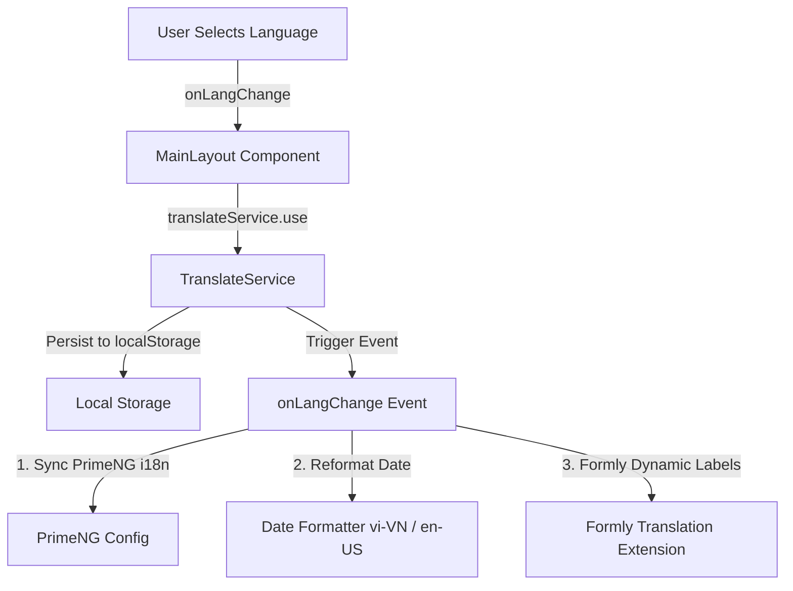

# Hướng dẫn Kiến trúc và Luồng Logic Xử lý Chuyển đổi Ngôn ngữ (i18n) - Dự án TaskFlow

Tài liệu này cung cấp cái nhìn chi tiết và toàn diện về quy tắc, cách thức hoạt động cũng như luồng logic xử lý của hệ thống đa ngôn ngữ (i18n) trong dự án **TaskFlow**.

---

## 1. Kiến trúc Tổng quan và Các Thành phần Chính

Hệ thống đa ngôn ngữ của dự án được xây dựng dựa trên bộ thư viện **ngx-translate** (`@ngx-translate/core` và `@ngx-translate/http-loader`), tích hợp chặt chẽ với hệ thống Form động **Formly** và thư viện UI **PrimeNG**.



### Các tệp nguồn chính liên quan:
* **Cấu hình chung**: [app.config.ts](file:///d:/TaskFlow/frontend/src/app/app.config.ts)
* **Khởi tạo hệ thống**: [app.ts (AppComponent)](file:///d:/TaskFlow/frontend/src/app/app.ts)
* **Giao diện chuyển đổi**: [main-layout.ts](file:///d:/TaskFlow/frontend/src/app/layouts/main-layout/main-layout.ts) và [main-layout.html](file:///d:/TaskFlow/frontend/src/app/layouts/main-layout/main-layout.html)
* **Tệp tài nguyên dịch thuật**: 
  - Tiếng Anh: [en.json](file:///d:/TaskFlow/frontend/public/assets/i18n/en.json)
  - Tiếng Việt: [vi.json](file:///d:/TaskFlow/frontend/public/assets/i18n/vi.json)

---

## 2. Cách thức Cấu hình & Bootstrapping

Hệ thống được thiết lập và cung cấp ở mức ứng dụng toàn cục trong [app.config.ts](file:///d:/TaskFlow/frontend/src/app/app.config.ts):

### A. Đăng ký Loader tải file JSON tĩnh:
Hàm `HttpLoaderFactory` định nghĩa cách ứng dụng tải các file dịch thuật. Nó sử dụng `HttpClient` để thực hiện yêu cầu HTTP GET tải các file JSON tĩnh từ thư mục `/assets/i18n/`:
```typescript
export function HttpLoaderFactory(http: HttpClient) {
  return new TranslateHttpLoader(http, '/assets/i18n/', '.json');
}
```

### B. Khởi tạo Translate Service trong Provider:
```typescript
provideTranslateService({
  loader: {
    provide: TranslateLoader,
    useFactory: HttpLoaderFactory,
    deps: [HttpClient]
  }
})
```

---

## 3. Quản lý Dữ liệu Dịch thuật (Translation Files)

Các file tài nguyên dịch thuật được đặt trong thư mục `/assets/i18n/` định dạng JSON. Cấu trúc của chúng được tổ chức phân cấp theo từng màn hình hoặc tính năng để dễ bảo trì:

```json
{
  "COMMON": {
    "SUCCESS": "Thành công",
    "ERROR": "Lỗi"
  },
  "HEADER": {
    "HELLO": "Xin chào, {{name}}!",
    "LOGOUT": "Đăng xuất"
  },
  "AUTH": {
    "LOGIN_BTN": "Đăng nhập",
    "REGISTER_BTN": "Đăng ký"
  }
}
```

> [!NOTE]
> Hệ thống hỗ trợ truyền biến động vào chuỗi dịch bằng cú pháp `{{biến}}` (ví dụ: `HEADER.HELLO` nhận biến `name`).

---

## 4. Cơ chế Hoạt động & Khởi tạo (Lifecycle)

Quy trình hoạt động được kích hoạt ngay khi ứng dụng khởi chạy tại [app.ts (AppComponent)](file:///d:/TaskFlow/frontend/src/app/app.ts):

1. **Thiết lập ngôn ngữ dự phòng (Fallback Language)**: Nếu một key dịch không tồn tại ở ngôn ngữ hiện tại, hệ thống sẽ tự động dùng bản dịch tiếng Anh:
   ```typescript
   this.translateService.setFallbackLang('en');
   ```
2. **Khôi phục ngôn ngữ đã lưu**: Hệ thống kiểm tra xem người dùng đã từng chọn ngôn ngữ trước đó chưa từ `localStorage` thông qua key `'lang'`. Nếu chưa, mặc định sẽ là tiếng Anh `'en'`:
   ```typescript
   const savedLang = localStorage.getItem('lang') || 'en';
   this.translateService.use(savedLang);
   ```
3. **Đồng bộ hóa cấu hình PrimeNG**: PrimeNG sở hữu các nhãn mặc định của riêng mình (ví dụ nút "Clear", tiêu đề tìm kiếm, các tháng trong lịch). Khi ngôn ngữ thay đổi, sự kiện `onLangChange` phát ra, hệ thống nạp các cấu hình dịch i18n tương ứng vào PrimeNG config:
   ```typescript
   this.translateService.onLangChange.subscribe(() => {
     this.translateService.get('primeng').subscribe(res => {
       this.primengConfig.setTranslation(res);
     });
   });
   ```

---

## 5. Luồng Logic Xử lý khi Người dùng Thay đổi Ngôn ngữ

Hành động thay đổi ngôn ngữ diễn ra tại Header của [MainLayout](file:///d:/TaskFlow/frontend/src/app/layouts/main-layout/main-layout.ts):

### Bước 1: Giao diện Dropdown lựa chọn
Người dùng tương tác với dropdown `<p-select>` hiển thị cờ quốc gia (🇬🇧/🇻🇳) và nhãn tương ứng. Khi chọn ngôn ngữ mới, sự kiện `(onChange)` gọi hàm `onLangChange($event.value)`.

### Bước 2: Xử lý thay đổi tại Component
Hàm `onLangChange(lang)` thực hiện:
```typescript
onLangChange(lang: string): void {
  this.translateService.use(lang);   // 1. Áp dụng ngôn ngữ mới toàn cục
  localStorage.setItem('lang', lang); // 2. Lưu trạng thái vào localStorage để ghi nhớ
  this.currentLang = lang;           // 3. Cập nhật biến trạng thái hiện tại
}
```

### Bước 3: Lắng nghe và đồng bộ dữ liệu (Reactions)
Khi `translateService.use(lang)` được thực hiện, `ngx-translate` sẽ tải file JSON tương ứng (nếu chưa được tải) và phát đi sự kiện toàn cục `onLangChange`. Các component đăng ký lắng nghe sự kiện này sẽ tự động cập nhật:
* **Định dạng Ngày tháng**: `MainLayout` lắng nghe để định dạng lại ngày giờ hiển thị trên Header:
  ```typescript
  this.translateService.onLangChange.subscribe((event) => {
    this.currentLang = event.lang;
    this.updateDate(); // Cập nhật locale 'vi-VN' hoặc 'en-US' cho toLocaleDateString()
  });
  ```
* **Đồng bộ form động Formly**: Extension dịch tự động dịch các nhãn placeholder và nhãn trường của Form.

---

## 6. Cách Áp dụng Dịch thuật trên Giao diện (Templates)

Dự án áp dụng dịch thuật trên HTML thông qua 3 cách chính:

### Cách 1: Sử dụng Pipe dịch thuật (`TranslatePipe` - Khuyên dùng)
Đây là cách phổ biến nhất để dịch các đoạn text tĩnh trên giao diện HTML:
```html
<p-button [label]="'AUTH.LOGIN_BTN' | translate"></p-button>
```

### Cách 2: Sử dụng Pipe dịch thuật kèm Biến động (Interpolation)
Dùng khi chuỗi dịch cần chứa các thông tin thay đổi động (nhên tên người dùng):
```html
<h2>{{ 'HEADER.HELLO' | translate:{ name: user?.name } }}</h2>
```

### Cách 3: Dịch tự động với Formly Config Extension (Nâng cao)
Đối với các biểu mẫu động sử dụng Formly, lập trình viên khai báo key dịch trong cấu hình trường. Extension `translate-extension` được khai báo toàn cục trong [app.config.ts](file:///d:/TaskFlow/frontend/src/app/app.config.ts#L85) sẽ tự động lắng nghe ngôn ngữ và dịch:
```typescript
// Định nghĩa cấu hình trong Component
taskFields = [
  {
    key: 'title',
    type: 'input',
    props: {
      label: 'TASKS.FORM.TITLE_LABEL',        // Tự động dịch qua translate-extension
      placeholder: 'TASKS.FORM.TITLE_PH',     // Tự động dịch qua translate-extension
      required: true
    }
  }
]
```
Extension sẽ ánh xạ nhãn động bằng cách gán `field.expressionProperties['props.label'] = translate.stream(props['label'])`.

---

## 7. Tổng kết Quy tắc Vàng khi Làm việc với i18n trong TaskFlow

1. **Khai báo key trước**: Khi thêm nhãn hoặc text mới, luôn luôn thêm key và nội dung dịch tương ứng vào cả hai tệp [en.json](file:///d:/TaskFlow/frontend/public/assets/i18n/en.json) và [vi.json](file:///d:/TaskFlow/frontend/public/assets/i18n/vi.json).
2. **Không hardcode text**: Tránh viết chữ cứng trực tiếp trong HTML hoặc file TypeScript, hãy luôn sử dụng pipe `| translate` hoặc `translateService.instant()` / `translateService.stream()`.
3. **Cập nhật cả nhãn PrimeNG**: Nếu thêm các component PrimeNG đặc biệt có các nhãn mặc định (như Paginator, Dialog), hãy bổ sung các cấu hình dịch cho key `"primeng"` trong các tệp ngôn ngữ JSON.
